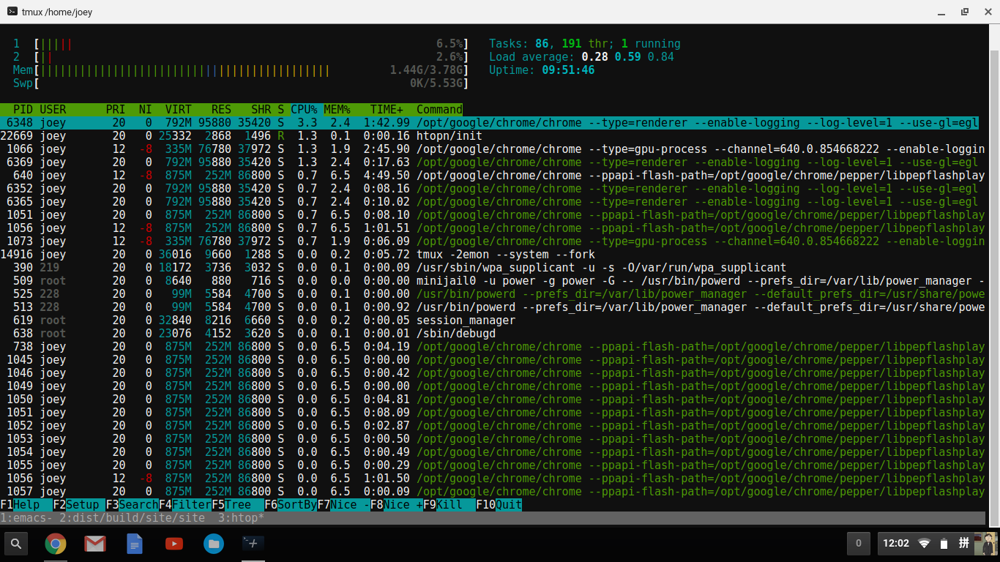
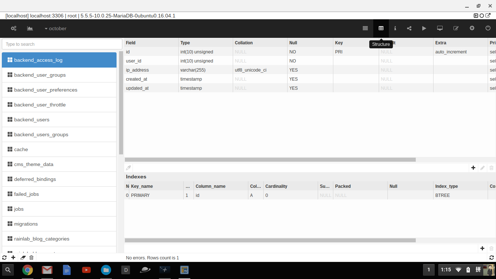

今年2月份附近入手的一台二手chromebook，到目前为止已经用了很长一段时间了，打算写一篇文章来总结一下使用体验。

先来看看我的屏幕截图，目前看起来还觉得挺geek的

终端模拟器是用的chrome的一个插件叫做crosh window

linux虚拟机是用crouton安装的ubuntu16.04 core,可惜是共享内核的，所以ubuntu的内核也是3.10.18的

一些常用工具包括：

1. fish，我最喜欢的shell
2. tmux，终端复用软件，可以开启多个会话
3. ss，用来上网的，开启之后chromebook也可以共享上网，真不错
4. emacs，我最爱的编辑器，之前crouton遇到最大的问题是中文输入法，有了emacs之后我可以用自带的pyim来输入中文了，没必要使用chromebook自带的输入法
5. 开发环境，nginx, mysql, php7, python, rvm等等之类的
6. 数据库连接是用一个叫做myadmin的chrome扩展实现的

遇到的问题：

1. cpu性能太差劲，我的lenovon21用的cpu是intel n2840的，一款低功耗的arm架构双核cpu，在打开多个浏览器标签时资源使用率总是达到100%，我在编译代码的时候就更费劲了，昨晚编译hakyll花了1个多小时，用公司的thinkpad t440s编译大概10分钟能搞定

2. 显示器太渣，现在应该没有720p的笔记本显示器了吧，看着觉得很糢糊

3. 机身是黑色塑料的，看起来很廉价，没有chromebook pixel和mac book pro那么银光闪闪

4. 还是cpu太差劲，平时敲代码打字都有明显的卡顿了

总结一下：

1. google是一家非常伟大的公司，感谢他们发明了chromebook这么伟大的产品

2. 联想是美帝良心企业，在国内就买不到chromebook，国内的thinkpad价格也要比美帝高出一截

3. n21还算是一款性价比非常好的本子，就是性能有点弱，17年再换一个16年出的二手chromebook玩玩
