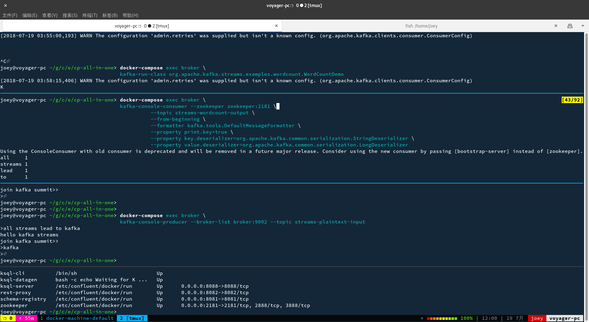

docker 的使用方式有很多，很多发行版都带了 docker 软件包，比如说在 archlinux 上就可以执行

```bash
sudo pacman -S docker
```

按照 wiki 上的说法配置好环境然后就能执行命令了，但是这种方法不通用，比如说换了机器或者是本地配置有差，都可能需要重新弄一次，所以有人就出了一个`docker-machine`

`docker-machine`的原理是让 docker 跑在本地的虚拟机里面，比如说本地开一个 virtualbox 虚拟机，然后在虚拟机里面操作 docker，这种方式不污染本地环境

使用很简单，按照官方的教程一步一步来：

1. `docker-machine create --driver virtualbox default` 创建一台用来操作 docker 的机器
2. `docker-machine ls` 列出当前电脑上装的所有 docker 宿主机，理论上来说远程的宿主机也能列出来
3. `docker-machine start name` 开启一台宿主机，然后在宿主机里面跑docker，随意安装镜像，环境玩坏了不想要了直接删除这台机器再建一个新的就好，不用担心本机被玩坏
4. `eval (docker-machine env default)` 进入default宿主机内，这样就能在宿主机上执行docker命令了

## 安装 confluent platform

### 运行word count的示例图



截图中最上面一屏是 word count的process程序，第二屏运行的是kafka的消费程序，word count process程序把计算结果写入到输出流，被消费程序读出，第三屏展示的是一个命令行的生产者，把一个一个的单词输入到输入流中，每有一个输入就会被实时消费，这样第二屏中的输出就会立刻被更新。第四屏展示的是`docker-compose ps`的输出，显示当前运行的docker进程，因为使用的官方的配置文件，所以端口映射啥的都不用管，有一个需要注意的点，因为是多个容器组合运行，所以不建议采用手动指明host的方式来访问服务，比如说在`kafka-console-producer --broker-list localhost:9092 --topic streams-plaintext-input`这条命令中不要用`localhost:9092`来访问kafka，要使用`kafka-console-producer --broker-list broker:9092 --topic streams-plaintext-input`，同时运行这么多容器，根本不知道localhost是哪个容器的localhost

从截图可以看出 kafka streams 用来做实时日志分析很有用

## 使用ksql

### 创建对应的kafka topic

创建名为users的topic

```bash
docker-compose exec broker \
  kafka-topics --create --zookeeper zookeeper:2181 \
  --replication-factor 1 --partitions 1 --topic users
```

创建名为pageviews的topic

```bash
docker-compose exec broker \
  kafka-topics --create --zookeeper zookeeper:2181   \
  --replication-factor 1 --partitions 1 --topic pageviews
```

列出当前kafka所有的topic

```bash
docker-compose exec broker \
  kafka-topics --zookeeper zookeeper:2181 --list
```

### 往上面创建的2个topic里面塞入数据

待定，使用producer cli写入

```bash
docker-compose exec ksql-datagen \
  ksql-datagen bootstrap-server=broker:9092 quickstart=pageviews format=delimited topic=pageviews maxInterval=100
```

### 创建stream

开启ksql

```bash
docker-compose exec ksql-cli ksql http://ksql-server:8088
```

在ksql-cli中执行

```bash
CREATE STREAM pageviews_original (viewtime bigint, userid varchar, pageid varchar) WITH \
(kafka_topic='pageviews', value_format='DELIMITED');
```

```bash
CREATE TABLE users_original (registertime BIGINT, gender VARCHAR, regionid VARCHAR, userid VARCHAR) WITH \
(kafka_topic='users', value_format='JSON', key = 'userid');
```

查看ktable信息

```bash
describe users_original;
```

查看当前的所有stream信息

```bash
show streams;
```

查看当前所有table信息

```bash
show tables;
```

### 通过restapi接口查询stream

接口文档见[https://docs.confluent.io/current/ksql/docs/api.html](https://docs.confluent.io/current/ksql/docs/api.html)

如果别的语言要访问ksql目前看来只能自己实现一套restapi的封装了，遇到过提示stream/table找不到的，按照文档说明给加上bootstrap.servers就行了
8088是ksql-server监听的端口，默认的broker监听的是9092端口

```bash
curl -XPOST http://localhost:8088/query/ \
    -H 'Accept: application/json' \
    -H 'Content-Type: application/json' \
    -d '{
        "ksql": "SELECT * FROM users_original limit 10;",
        "streamsProperties": {
            "ksql.streams.auto.offset.reset": "earliest"
        }
    }'
```

```bash
CREATE TABLE pageviews_regions WITH (value_format='avro') AS SELECT gender, regionid , COUNT(*) AS numusers \
FROM pageviews_enriched WINDOW TUMBLING (size 30 second) GROUP BY gender, regionid HAVING COUNT(*) > 1;

CREATE STREAM pageviews_enriched AS SELECT users_original.userid AS userid, pageid, regionid, gender \
FROM pageviews_original LEFT JOIN users_original ON pageviews_original.userid = users_original.userid;

CREATE STREAM pageviews_female AS SELECT * FROM pageviews_enriched WHERE gender = 'FEMALE';

CREATE STREAM pageviews_female_like_89 WITH (kafka_topic='pageviews_enriched_r8_r9', \
value_format='DELIMITED') AS SELECT * FROM pageviews_female WHERE regionid LIKE '%_8' OR regionid LIKE '%_9';

SELECT gender, regionid, numusers FROM pageviews_regions LIMIT 5;
```

```bash
CREATE TABLE ontime
(
    Year UInt16,
    Quarter UInt8,
    Month UInt8,
    DayofMonth UInt8,
    DayOfWeek UInt8,
    FlightDate Date,
    UniqueCarrier FixedString(7),
    AirlineID Int32,
    Carrier FixedString(2),
    TailNum String,
    FlightNum String,
    OriginAirportID Int32,
    OriginAirportSeqID Int32,
    OriginCityMarketID Int32,
    Origin FixedString(5),
    OriginCityName String,
    OriginState FixedString(2),
    OriginStateFips String,
    OriginStateName String,
    OriginWac Int32,
    DestAirportID Int32,
    DestAirportSeqID Int32,
    DestCityMarketID Int32,
    Dest FixedString(5),
    DestCityName String,
    DestState FixedString(2),
    DestStateFips String,
    DestStateName String,
    DestWac Int32,
    CRSDepTime Int32,
    DepTime Int32,
    DepDelay Int32,
    DepDelayMinutes Int32,
    DepDel15 Int32,
    DepartureDelayGroups String,
    DepTimeBlk String,
    TaxiOut Int32,
    WheelsOff Int32,
    WheelsOn Int32,
    TaxiIn Int32,
    CRSArrTime Int32,
    ArrTime Int32,
    ArrDelay Int32,
    ArrDelayMinutes Int32,
    ArrDel15 Int32,
    ArrivalDelayGroups Int32,
    ArrTimeBlk String,
    Cancelled UInt8,
    CancellationCode FixedString(1),
    Diverted UInt8,
    CRSElapsedTime Int32,
    ActualElapsedTime Int32,
    AirTime Int32,
    Flights Int32,
    Distance Int32,
    DistanceGroup UInt8,
    CarrierDelay Int32,
    WeatherDelay Int32,
    NASDelay Int32,
    SecurityDelay Int32,
    LateAircraftDelay Int32,
    FirstDepTime String,
    TotalAddGTime String,
    LongestAddGTime String,
    DivAirportLandings String,
    DivReachedDest String,
    DivActualElapsedTime String,
    DivArrDelay String,
    DivDistance String,
    Div1Airport String,
    Div1AirportID Int32,
    Div1AirportSeqID Int32,
    Div1WheelsOn String,
    Div1TotalGTime String,
    Div1LongestGTime String,
    Div1WheelsOff String,
    Div1TailNum String,
    Div2Airport String,
    Div2AirportID Int32,
    Div2AirportSeqID Int32,
    Div2WheelsOn String,
    Div2TotalGTime String,
    Div2LongestGTime String,
    Div2WheelsOff String,
    Div2TailNum String,
    Div3Airport String,
    Div3AirportID Int32,
    Div3AirportSeqID Int32,
    Div3WheelsOn String,
    Div3TotalGTime String,
    Div3LongestGTime String,
    Div3WheelsOff String,
    Div3TailNum String,
    Div4Airport String,
    Div4AirportID Int32,
    Div4AirportSeqID Int32,
    Div4WheelsOn String,
    Div4TotalGTime String,
    Div4LongestGTime String,
    Div4WheelsOff String,
    Div4TailNum String,
    Div5Airport String,
    Div5AirportID Int32,
    Div5AirportSeqID Int32,
    Div5WheelsOn String,
    Div5TotalGTime String,
    Div5LongestGTime String,
    Div5WheelsOff String,
    Div5TailNum String
)
ENGINE = MergeTree(FlightDate, (Year, FlightDate), 8192);

for i in *.zip; do echo $i; unzip -cq $i '*.csv' | sed 's/\.00//g' | clickhouse-client --host=example-perftest01j --query="INSERT INTO ontime FORMAT CSVWithNames"; done
```
