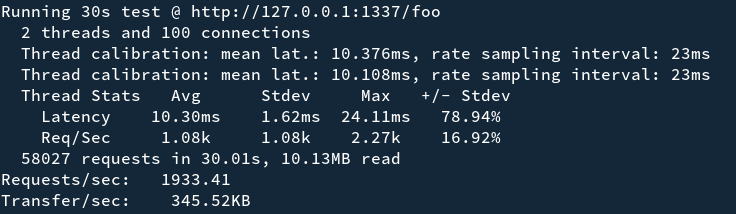
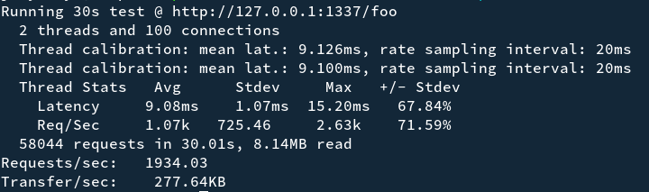
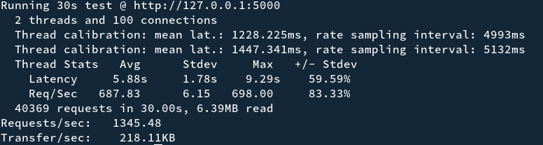

# 用 php 开发类似 go 的高性能服务器

项目地址：[https://github.com/xcaptain/gophp](https://github.com/xcaptain/gophp)

## 自己写的 php 服务器框架代码

```bash
php main.php
```

### 性能测试

```bash
wrk2 -t2 -c100 -d30s -R2000 http://127.0.0.1:1337/foo
```

结果：



## 最简单的 go 语言实现的服务器

```go
package main

import (
	"fmt"
	"net/http"
)

func main() {
	http.HandleFunc("/foo", func(w http.ResponseWriter, r *http.Request) {
		fmt.Fprintf(w, "Hello, you've requested: %s\n", r.URL.Path)
	})

	http.ListenAndServe(":1337", nil)
}
```

### 性能测试

```bash
wrk2 -t2 -c100 -d30s -R2000 http://127.0.0.1:1337/foo
```

结果：



## flask 的简单例子

```python
from flask import Flask
app = Flask(__name__)

@app.route("/")
def hello():
    return "Hello World!"
```

### 性能测试

```bash
wrk2 -t2 -c100 -d30s -R2000 http://127.0.0.1:5000/
```

结果：



## 总结

就上面 wrk 的测试结果来看，gophp 的性能已经很接近 go 原生的性能了，接下来再加上更多功能测试下