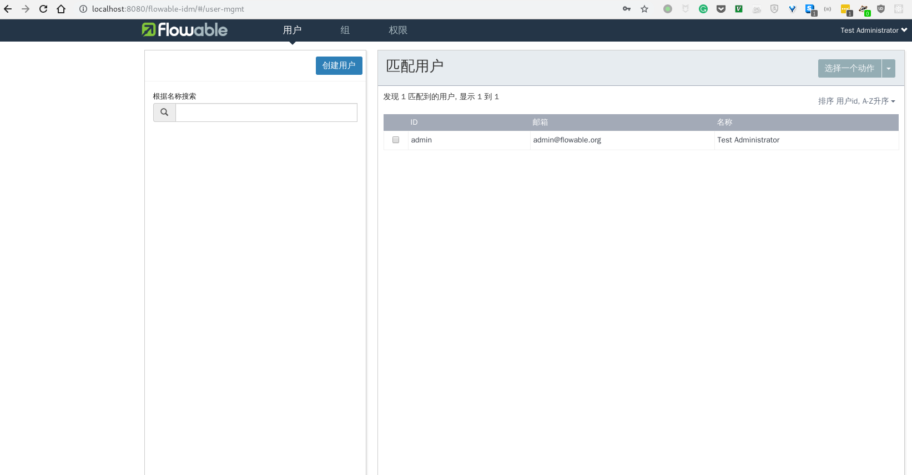
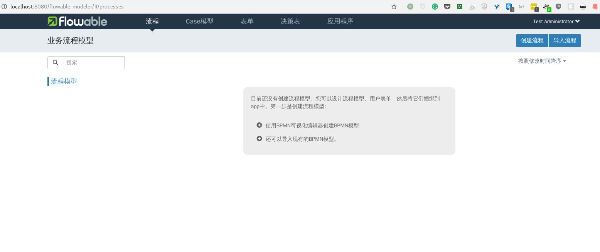
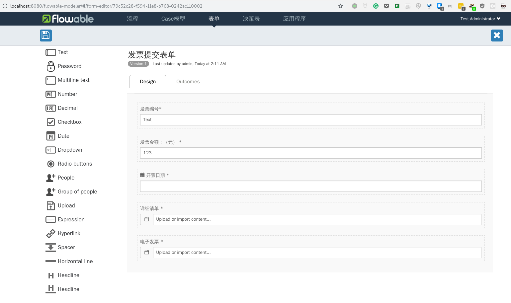

业务流程引擎（business process engine, bpm）在很多地方都有很广泛的应用，尤其是处理复杂多变的业务场景更是方便，因为对于很明确的需求可以硬编码实现业务逻辑，但是对于未知的复杂多变的业务场景，就需要上bpm了，这样能根据实际业务流程建模，从而处理更加复杂的任务

bpm和workflow engine有相似之处，但是bpm偏向于处理大规模业务逻辑，而workflow engine比较适合处理单一工作流，因为实际业务中经常是多条工作流交织在一起，所以还是bpm比较强大。最近因为工作原因调研了一下这个领域，有点收获做个笔记

## 开源的bpm套件

- jbpm 红帽公司负责研发的
- activity 从jbpm出来的那波人搞得
- flowable activity核心人员离职出来搞的
- camunda 德国一家公司开发的，最初也是从activity fork出来的，不过现在已经偏离很大了
- zeebe camunda这家公司开发的新项目，据说性能更高，但是目前（2018-12-02）还处于开发阶段

## 开源的workflow engine

- airflow 最流行的workflow engine，不过主要是用于大数据场景，用来执行各种复杂的构建任务或者ETL
- cadence uber开源的go语言实现的工作流引擎，支持解析yml文件生成工作流

## 云服务

- kissflow 最有名的云服务莫过于这家了，印度厂商，基于GAE部署的，国内肯定是用不了，而且每人每月9刀也太贵了
- qingflow 国内类似kissflow的一家创业公司搞的，目前看来功能还比较初级，但是在国内来说做得算比较好了
- aws step functions 亚马逊云的一个服务，不是专门处理企业级业务流程的，但是因为实现了一个状态机，如果配合aws其他服务比如api gateway, lambda function也能实现分步业务流程，不过目前（2018-12-02）中国区还没有开启step function这个服务
- azure logic apps 微软云的服务，类似于aws step functions的实现，但是噱头是更适合企业应用开发，我注册了账号体验但是感觉不如aws简单

在我进行技术选型的时候，首先就把kissflow排除了，因为国内访问不了GAE，而qingflow太小的创业公司，数据交给他们不放心，aws和azure虽然是大厂数据安全有保障但是毕竟提供的服务太原始，要基于它们开发自己的应用还是有比较大工作量的。cadence我仔细研究了一下，功能还是比较强大的，代码很简单使用很方便，但是目前来说最大的问题是没法查询进行中的工作流的内部状态，比如说一个审批流执行到第二阶段了，cadence就知道流程在进行中但是不知道进行到哪一步了，具体可见[https://github.com/uber/cadence/issues/350](https://github.com/uber/cadence/issues/350)这个issue，都一年了还没解决这个问题，对于我来说审批流程可视化是基础功能，缺少这个功能就暂时不考虑了。剩下在bpm套件中选择，zeebe不考虑，太初级不稳定，jbpm和activity也不考虑，毕竟核心人员都跳槽到flowable团队去了，我试用了flowable和camunda，虽然camunda算是业内比较牛逼的公司客户也很多，但是这软件做得不太敢苟同，界面很丑陋，本地化功能没做好，而且开发版功能缺失而企业版又需要花钱买授权所以也不考虑。flowable试用之后挺震撼的，虽然是一个完全开源的项目，但是代码质量很高，而且开发节奏也很稳定，在youtube搜到一个他们17年的演讲视频，是介绍如何引入AI做一些决策辅助操作的，做bpm的也要与时俱进，佩服。

接下来简单说说如何使用flowable

## 使用flowable

### 使用docker安装

```sh
docker run -p 8080:8080 flowable/all-in-one
```

从docker hub下载全部服务一体包，里面包含：

1. [Flowable IDM](http://localhost:8080/flowable-idm) 身份管理服务
2. [Flowable Modeler](http://localhost:8080/flowable-modeler) 建模器
3. [Flowable Task](http://localhost:8080/flowable-task) 任务管理服务
4. [Flowable Admin](http://localhost:8080/flowable-admin) 管理员平台

### 添加用户

以管理员身份访问IDM创建用户，或者是添加组，把用户分配到组，默认账号是admin密码是test



### 创建流程模型

创建好用户分配好角色与权限后再创建流程模型，flowable支持bpmn2.0标准来建模业务流程



建模的时候会要关联表单，通过这种图形化的操作，设计各个环节的表单很方便



### 发起一个流程

### 在任务平台处理各自的任务

### 在管理平台查看任务状态
