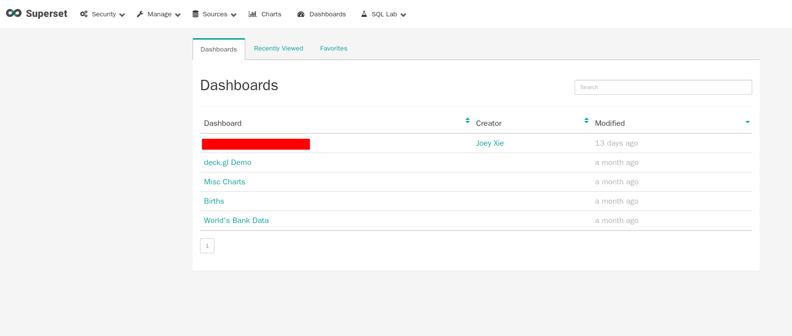
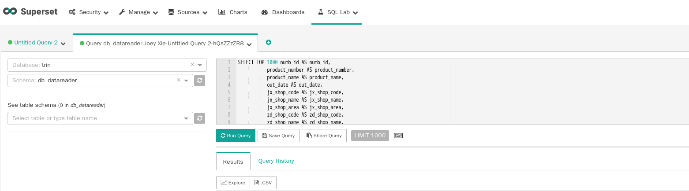
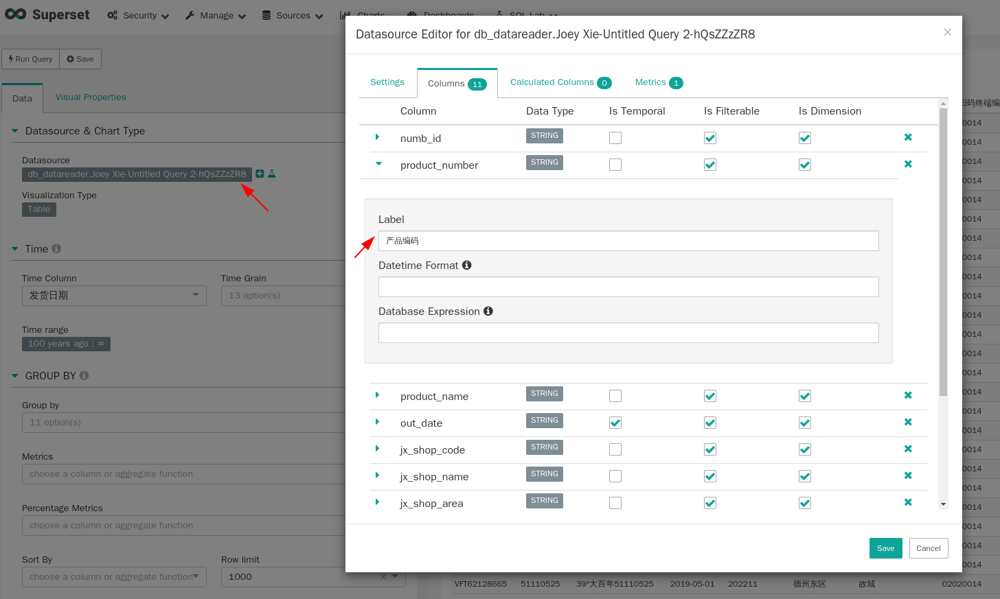

在选型的时候还考虑过redash，这个软件也很强大，但是似乎是个人项目，只有一个核心开发者，而superset是airbnb孵化的，apache基金会运营的，所以研发实力还是信得过的，应该会持续提供维护。简单看了一下superset的代码，前端是用react开发的，后端使用flask开发，整体架构还是比较简单清晰的

## 快速部署

看快速部署上线解决客户的问题最简单的办法就是使用docker镜像，官方的docker太简陋了，缺少很多数据源驱动，本地元数据存储也需在自己配置，使用起来不方便，我使用的是[https://github.com/amancevice/docker-superset](https://github.com/amancevice/docker-superset)重新打包的镜像，做了很多自定义设置，使用起来很方便

使用很简单，这个项目就是个docker-compose的配置，包含了如何本地构建superset镜像（默认配置，默认数据源驱动等），设置缓存和元数据数据库，我的数据是是`SQL Server`，选择的本地存储数据库是`PostgreSQL`，缓存当然是`Redis`，很快就跑起来了

## 快速上手

按照上述步骤部署完成后会得到一个管理员账号，浏览器访问superset后台，输入帐号密码进入，看到的界面如下：


和大部分BI系统一样，一个是控制面板列表，一个是报表列表，要做的事就是

1. 写SQL
2. 创建报表
3. 把报表添加到控制面板，并设置访问权限

superset内置了一个很强大的`SQL Lab`，在这里可以调试自己的sql，当然大部分人都是在本地用编辑器是sql然后放到sql lab运行。在sql lab测试没问的的sql可以把查询结果视为一个数据源（datasource），sql lab支持把这个数据源创建为报表（chart）



点这里的explore就能把数据结果创建为报表

接下来对报表的操作都很显然，界面设计的很直观，看一眼基本就知道怎么用，不知道的地方查看一下官方文档就行了。这里要注意一点，在是sql的时候我们喜欢使用别名，比如说`select name as 姓名`类似这样的写法，为了方便阅读结果，但是目前superset只支持别名是ascii字符，如果要导出普通人可读的报表（字段名都是中文）那该怎么办呢？



在这里给每个列添加一个别名就行了，然后刷新结果就能看到对应的中文字段

## 权限控制

对于一个BI系统来说，权限控制当然很重要，不然谁都能看核心数据就乱套了。核心也就是RBAC，先创建一个帐号，再创建一个角色，把角色赋予这个帐号，然后把每个报表（数据源）的权限赋的对应角色就行了

## 调试

因为superset后端代码是用flask框架写的，所以改起来还算方便，我最近遇到个问题需要在导出csv文件的时候让表头变为中文，也就是使用上面设置的列名别名，分享下我修改源码的经历

首先要在本地跑起superset来，按照官方的文档做就行，简单说就是：

1. 创建virtual environment

   `python3 -m venv venv`

2. 激活当前虚拟环境

   `. venv/bin/activate.fish`

3. 安装依赖

    `pip install -r requirements.txt; pip install -r requirements-dev.txt`

4. 构建superset

   `pip install -e .`

5. 运行superset

    `superset run -p 8088 --with-threads --reload --debugger -h 0.0.0.0`

光跑起来还不够，想要知道系统内部是怎么运行的还需要配置好调试器，然后单步执行才能理解系统如何处理每个请求的，因为是flask app，我用的编辑器vscode的支持比较好，microsoft对python有官方支持，对flask 也有官方支持，所以在添加调试配置的时候选择flask app，就行，最后编辑`launch.json`把`flask_app`设置为`superset`就行，然后按下<kbd>F5</kbd>就能以调试模式运行superset了，接下来的套路就很简单，设置端点，单步执行，检查变量值。如果没有调试器的话对这么大型的项目要一步一步print查看变量值，简直没法执行。

最后我给官方提的补丁见[https://github.com/apache/incubator-superset/pull/7795](https://github.com/apache/incubator-superset/pull/7795)，很简单很清晰的改动，但还没有被合并进去。为了让我自己的服务器体验最新的补丁，我直写修改了docker容器里的代码，非常机智，这样就不用等上游合并了

```shell
docker exec -it -u 0 container_id /bin/bash # 以root身份执行shell
docker cp 5ede569d1a0a:/usr/local/lib/python3.6/site-packages/superset/viz.py .
docker cp 5ede569d1a0a:/etc/superset/superset-config.py .
```

把这2个文件从容器中复制出来，修改完再复制回去，然后重启docker容器就行，啥不会重启？执行`docker-compose restart`搞定
