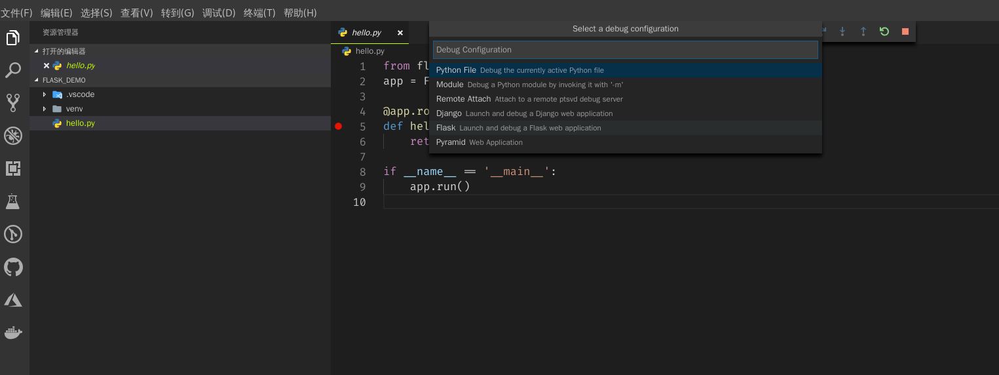
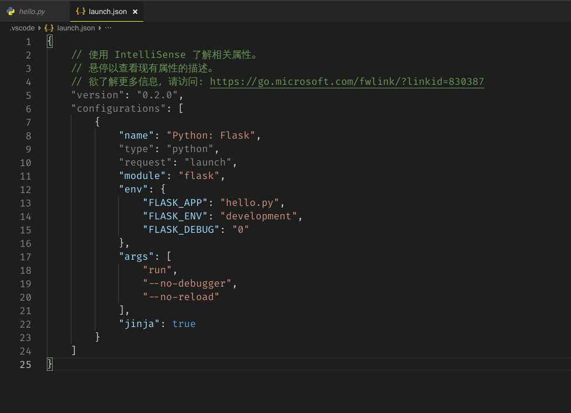
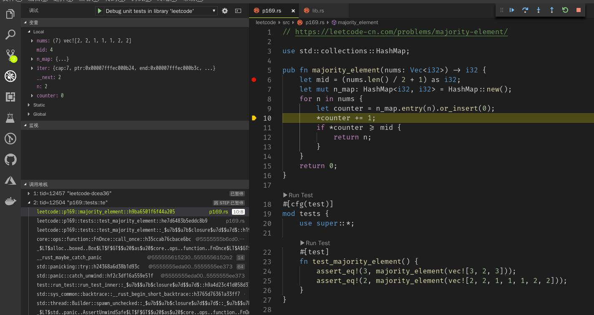
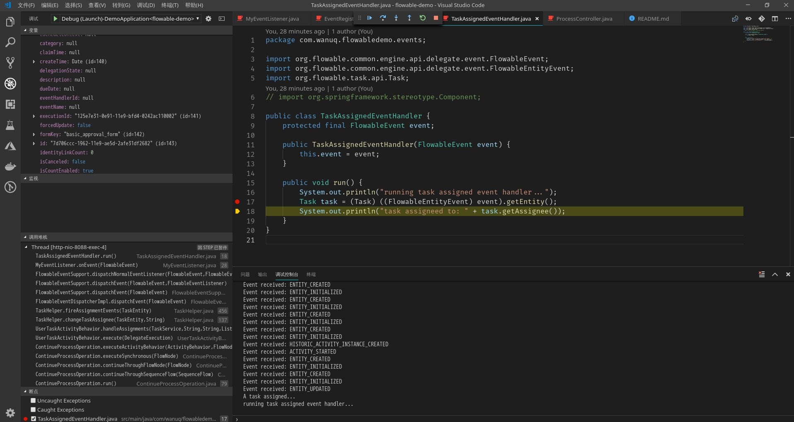
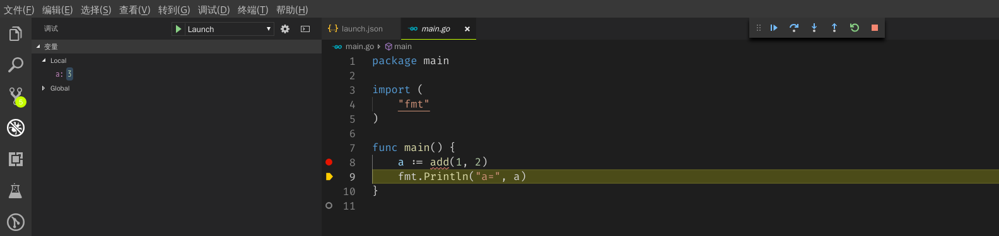

本文主要将介绍如何用vscode进行各种语言的项目进行调试，在没有好的工具链的远古时代，人们一般是用gdb,pdb来调试C/C++,python代码，后来有了IDE，可以在IDE里面进行调试，但是一般来说IDE和编程语言绑定太严重了，没法做到随意切换，后来有了vscode，微软牵头搞了LSP，CDP，使得在不同平台下编辑调试体验都很一致了

大体上来说调试程序的过程包括：

1. 生成带调试信息的二进制文件
2. 把这个二进制文件加载到调试器中运行

不管是过去的gdb命令行模式调，还是现在的vscode图形界面调，这2个基本原则都没变。接下来将举例说明如何用vscode配合语言扩展调试不同语言的项目

## python

Python是被vscode官方支持的语言，进入扩展市场搜索python，然后安装排名最靠前的微软官方的那个扩展就行了

### 调试一个简单的flask app

```shell
mkdir flask_demo
cd flask_demo
python3 -m venv venv
. venv/bin/activate.fish # 可能是bash文件是视当前shell环境的定
pip install Flask
```

创建一个简单的`app.py`文件，包含的内容如下：

```python
from flask import Flask
app = Flask(__name__)

@app.route('/')
def hello_world():
    return 'Hello World!'

if __name__ == '__main__':
    app.run()
```

用vscode打开这个项目，按下`F5`开始调试，遇到的界面如下：



选择flask，vscode会自动生成调试配置文件，具体见`.vscode/launch.json`，默认生成的flask 调试配置文件如下：



这样就以调试模式把代码跑起来了，相当于这个flask app是在调试器内运行，所以可以监控当前变量，单步执行等

## 调试rust代码

rust语言没有被vscode官在支持，但是社区做了很多工作，基本算是可用。首先建议安装[rust-analyzer](https://github.com/rust-analyzer/rust-analyzer)，这是rust的lsp，用来进行代码跳转补齐。其次安装[lldb](https://marketplace.visualstudio.com/items?itemName=vadimcn.vscode-lldb)，用于把rust二进制文件放调试器运行

### 调试一个简单的rust项目

测试项目见：[https://github.com/xcaptain/rust-algorithms](https://github.com/xcaptain/rust-algorithms)

调试效果图如下：



很显然，调试器上部可以看到当前变量的值，下部可以看调的堆栈

## 调试java代码

安装vscode的java扩展之后，套路是一样的，上一张调试spring boot项目的图



## 调试go代码

这回不用框架，手写一个简单的例子演示如何调试

```go
package main

import (
	"fmt"
)

func main() {
	a := add(1, 2)
	fmt.Println("a=", a)
}

func add(a int, b int) int {
	return a + b
}
```

这段是一个非常简单的go代码，用vscode打开这个项目，然后按下`F5`，编辑器会自动检测到项目类型而生成一个`.vscode/launch.json`的文件，有了这个文件编辑器就知道该怎么调试整个项目了

效果图如下：



## 高级用法

1. 如何调试mono repo(包含多个入口程序的项目)
2. 如何调试运行中的程序
