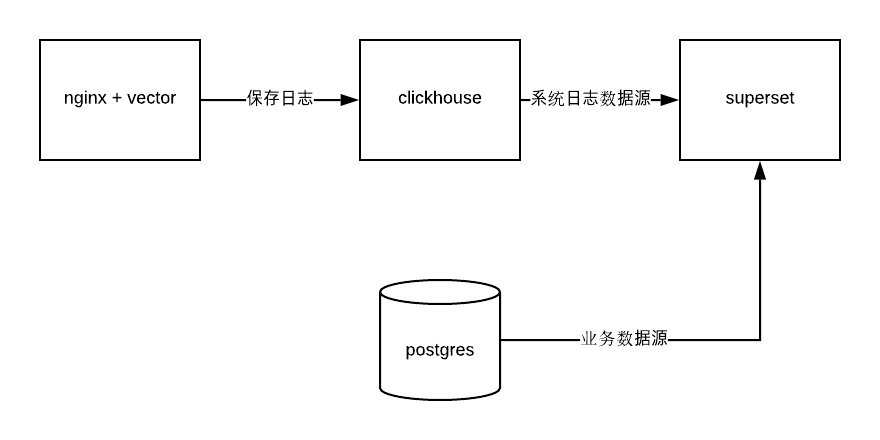
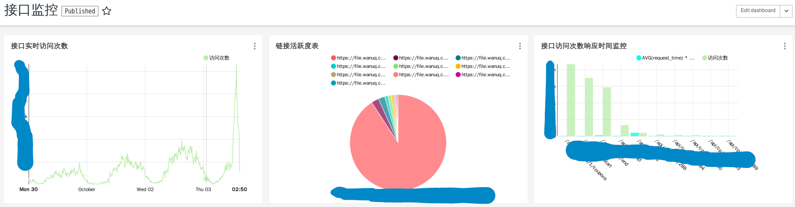

本文将介绍使用vector + nginx + clickhouse + superset 来实现自己的统一监控系统

## nginx

nginx作为日志来源是非常重要的一个环节，为了方便解析，在保存日志的时候用json的形式保存，以下是一个典型的配置示例

```nginx
log_format json_combined escape=json '{"localtime":"$time_iso8601",'
	'"source":"$server_addr",'
	'"remote_addr":"$remote_addr",'
	'"request_time":"$request_time",'
	'"status":"$status",'
	'"host":"$host",'
	'"uri":"$uri",'
	'"server":"$server_name",'
	'"protocol":"$server_protocol",'
	'"request_uri":"$request_uri",'
	'"args":"$args",'
	'"request_method":"$request_method",'
	'"http_referrer":"$http_referer",'
	'"http_x_forwarded_for":"$http_x_forwarded_for",'
	'"http_user_agent":"$http_user_agent"}';
server {
	server_name log.example.com;

	access_log /var/log/nginx/example.access.log json_combined;

	location /a.gif {
		empty_gif;
	}

	root /srv/http/example;
	index index.html;
}
```

在这里自定义了日志格式，并且指明了access_log使用这种日志格式保存，具体的日志配置可以见 
[nginx log config][1]
有个有意思的点，在配置一像素gif图的时候可以用 <em>empty_gif</em> ，这样访问的时候是内存操作而不需要去硬盘读取文件，这种方式实现的统计接口能达到很高的QPS，因为nginx实在是太快了

[1]: http://nginx.org/en/docs/http/ngx_http_log_module.html#example

## vector

vector 是一个日志收集系统，和fluentd类似，核心目的就是读取数据源的数据，经过transform和聚合后再写入到一个sink中，具体的使用可以见[https://github.com/timberio/vector](https://github.com/timberio/vector)，vector目前很强大的一点就是支持lua扩展，很多核心还没做的功能通过lua可以将就这做一下，比如说时间转换功能，我想把iso8601时间转为本地时间，可以用如下lua函数

```lua
function convertIso8601(s)
  local p='(%d+)-(%d+)-(%d+)T(%d+):(%d+):(%d+)'
  local year,month,day,hour,min,sec,tz=s:match(p)
  return os.date("%Y-%m-%d %T",os.time({day=day,month=month,year=year,hour=hour,min=min,sec=sec}))
end
```

vector目前还处于很初级的阶段，很多时候要自己改代码重新编译，因为官方不一定会采用你提交的pull request，要注意因为vector用到一些C的动态库，所以当想要编译静态库的时候还不能简单用musl编译，需要按照官方的打包脚本来做，曾经我花了很多时间去尝试编译，最后放弃了

* 给他们提新功能的issue：[https://github.com/timberio/vector/issues/867](https://github.com/timberio/vector/issues/867)
* 编译时遇到的问题：[https://github.com/timberio/vector/issues/877](https://github.com/timberio/vector/issues/877)

vector这个项目挺有意思的，而且代码库也不难懂，关于用vscode编译调试vector又可以写另一篇博客。要让vector跑起来最好创建一个systemd启动脚本

## clickhouse

去年曾经介绍过这个数据库，用来做大量数据的分析查询非常快速和方便。在这里我们使用docker来运行服务端和客户端

```shell
docker run --rm -d --name gt-clickhouse -p 8123:8123 --ulimit nofile=262144:262144 -v /var/lib/clickhouse:/var/lib/clickhouse -v /etc/localtime:/etc/localtime -v /etc/clickhouse-server/config.xml:/etc/clickhouse-server/config.xml yandex/clickhouse-server

docker run -it --rm --link gt-clickhouse:clickhouse-server yandex/clickhouse-client --host clickhouse-server
```

要比较注意的一点是配置默认用户和时区，因为是用docker跑的，所以在这里我们先把docker container的时区设置为与本机保持一致，然后设置superset的时区，默认是UTC，在`config.xml`中把时区设置为北京时间

```xml
  <timezone>Asia/Shanghai</timezone>
```

配置好时区后默认写入的时间就会按照这个时区来，比如说写入一个`2018-01-01 01:00:00`，这个时间会直接被当作北京时间存。

默认clickhouse是不支持写入带时区的时间的，但是有个配置可以开启，见：[https://clickhouse.yandex/docs/en/operations/settings/settings/#settings-date_time_input_format](https://clickhouse.yandex/docs/en/operations/settings/settings/#settings-date_time_input_format)

## superset

之前也介绍过superset的用法，并且还写过一篇调试superset的文章，目前来说开源的报表软件superset算是最强大的了，优点暂且不提我想列举下superset目前的缺点

1. 不支持下钻，这个问题在github issue提了很久了但是作者说下钻功能不会放到superset里面，因为这个和业务紧密相关，superset是一个业务无关的软件，具体见[https://github.com/apache/incubator-superset/issues/2890#issuecomment-305819244](https://github.com/apache/incubator-superset/issues/2890#issuecomment-305819244)
2. 不支持数据级别的权限控制，目前实现了角色级别的权限控制，即不同角色的人可访问的表格，dashboard不一样，但是对于更加精细的权限控制，比如说区域经理只能访问本区域下的数据，目前看来不支持这个实现

## 整体设计

数据流图如下：



nginx和vector部署在同一台web server上，这样日志写入后能及时被vector处理，一般来说clickhouse服务器压力不会太大，因为vector写入的时候是批量写入的，可能攒了几百条记录一次性写。到superset这级压力就更小了，数据随便查，clickhouse是出了名的高性能。另外superset可以配置多个数据源，所以可以把postgresql也加上，这样所有系统报表都从superset出，避免了统计口径混乱与重复工作的问题

这套统计平台最大的好处就是clickhouse和Postgresql都是基于SQL的，所以对使用人员来说学习成本很低，不像ELK查询起来不方便用户也没法自定义

一个简单的监控例子：



如此开发人员和运营人员用同一个后台就能同时监控服务器数据和业务数据，而且只要懂sql就可以自己创建报表，不需要麻烦别人，稍微培训下运营就能成为数据分析师
