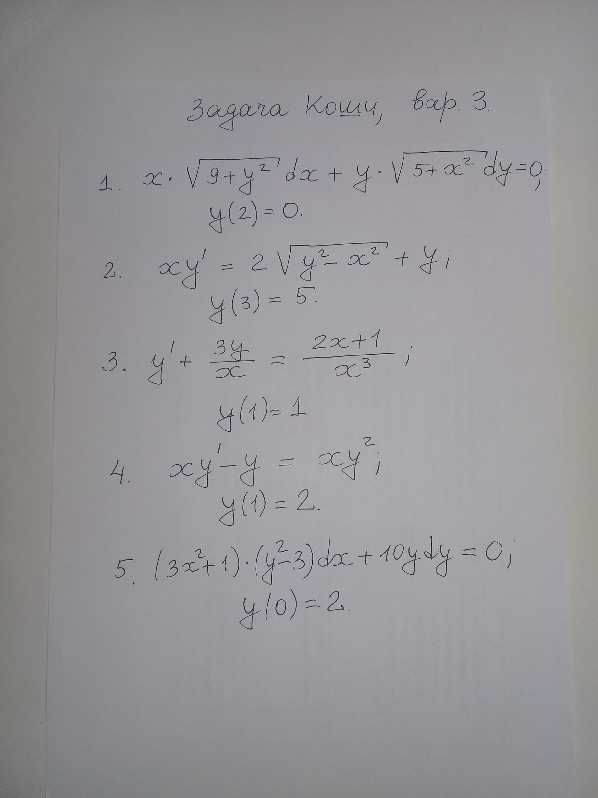

小老弟在俄罗斯读书，他们那边数学系似乎对计算要求很高，我拿到题看了一眼感觉就是简单的计算，一般数学系比较重视证明而轻视计算，记得当初上大学时我大一数学是最好的一年，因为那时候学微积分只要掌握好公式和题型就能解题，后来大二大三就跟不上了，因为那些证明题根本不会

下面是他发我的原题

都是些微分方程的题，思考了一下，只记得分离变量法，但是这些题看起来这么复杂分离变量法应该用不上，后来经过不断的googe才发现这些题都属于伯努利问题，看了一下网上的介绍之后就开始自己做吧

$$
xy'-y=xy^2
\\
y(1) = 2
$$

先转为微分的形式更好看

$$
\tag {1} x\frac {dy} {dx}-y=xy^2
$$

$$
\newline
令u=\frac 1 y，则y=\frac 1 u
\\
\because
\frac {dy} {dx} = \frac {dy} {du}  \frac {du} {dx}
\\
\therefore
\frac {dy} {dx} = - \frac 1 {u^2} \frac {du} {dx}
$$

将结果代入(1)得到

$$
\tag{2} \frac {du} {dx} = -1 - \frac {u} {x}
$$

此时还不是齐次的，因为-1不等于0，要继续换元

$$
令 u = vw
\\
\frac {du} {dx} = \frac {dv} {dx}w + \frac {dw} {dx} v
$$

代入（2）得到

$$
\tag{3} w(\frac {dv} {dx} + \frac {v} {x}) + v \frac {dw} {dx} = -1
$$

令

$$
\tag{4} \frac {dv} {dx} + \frac {v} {x} = 0
$$

此时我们得到了一个一阶齐次线性微分方程，可以用分离变量法了

$$
\tag{5} \frac 1 {v} dv = - \frac 1 {x} {dx}
$$

对（5）两边同时积分

$$
\int \frac 1 v dv = \int - \frac 1 {x} {dx}
\implies
ln(v) + k_1 = -ln(x) + k_2
\implies ln(vx) = k
\\
\implies
\tag{6} v = \frac k x
$$

把（6）代入到3中

$$
\frac {dw} {dx} \frac k x = -1
\tag{7} \implies kdw = -x dx
$$

对（7）两边同时积分

$$
\int kdw = \int -xdx
\implies kw + C_1 = -\frac 1 2 x^2 + C_2
\\
\tag{8} \implies w = -\frac 1 {2k} x^2 + C
$$

vw相乘得到u

$$
u = vw = \frac k x (-\frac 1 {2k} x^2 + C)
\implies
u =  -\frac 1 2 x + \frac C x
\\
y = \frac 1 u
\implies
\tag{9} y = \frac 1 {(-\frac 1 2 x + \frac C x)}
$$

将y(1)代入（9）得到常数 $C  = 1$

所以最终得到的y是

$$
y = \frac {2x} {2 - x^2}
$$

### 总结

虽然这道题形式看起来很简单，但是计算量着实不小，涉及到复合函数求导，函数乘法、除法求导，对数函数加减运算，对数函数积分公式等。题目不难，但是10年前我上大一的时候算这道题肯定会快很多，how time flies😄️
