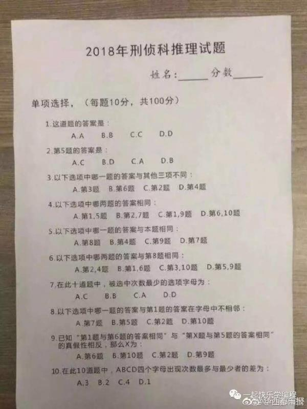

首先看到这道题会感觉一脸懵逼，这是啥题，仔细看发现可能会需要不断枚举来尝试推测可行解，如果一个个枚举的话，每道题有 4 种可能性，10 道题就有$4^{10} = 1048579$ 种可能性，太过于庞大了，如果要手动枚举的话必须要注意技巧剪枝

根据题目我们可以得到一些基本信息

1. 每道题都是单选题

   这个约束很强，如果发现一道题 2 个答案都对，那这个答案肯定是错的

2. 出现最少的答案只能出现 0 或 1 次

   这个结论非常有用，这个结论跟第 7 问紧密相关，因为第 7 问是单选题，所以如果最少的那个选项出现了 2 次，那么其它 3 个选项至少每个出现 3 次，那么总次数就超过 10 次了，不合理。因为这里题目比较复杂，知觉告诉我不会出现最少次数为 0 的情况，所以暂且认为最少的那个选项只出现 1 次

既然要推理那必须先做一些假设，如果推到矛盾则说明假设错误，换一个假设继续往下推。这里有 10 道题，案例来说可以从任何一道题入手假设，但是为了方便起见，我们最好先假设能带来最多信息量的那道题，道理很显然，第一问什么信息量都没有，如果从第一问入手，那就是白费力气，大体看来第 6、9 问包含的信息量比较大，分别与 3、4 个问题相关

我是从第 6 问开始推理的，也许从第 9 问入手会简单点吧（先不管了）第 6 问有 4 个可能性，按顺序来假设吧。因为我已经把题目做出来了，所以是开了上帝视角，先可以排除 2 个很显然的错误选项

若第 6 题选 D，则 5、8、9 这 3 题答案相同，根据第 5 题规则，如果 5、8、9 相同的话，第 5 题就出现多选了，AC 都可以，所以第 6 题不能选 D

若第 6 题选 B，则 1、6、8 这 3 题答案相同都为 B，

| 1   | 2   | 3   | 4   | 5   | 6   | 7   | 8   | 9   | 10  |
| --- | --- | --- | --- | --- | --- | --- | --- | --- | --- |
| B   | D   |     | B   | (B) | B   | D   | B   |     |     |
| B   |     |     |     | (D) | B   |     | B   |     |     |

根据第 8 题的条件，第 5 题的答案和第 1 题的答案不相邻，所以第 5 题可选 B/D，如果 5 选 B 的话，最后会得到 7 是 D，这时候 D 出现了 2 次，不可能是最少的。如果 5 选 D，则直接得到 7 也是 D，出现 2 次不可能是最少的，所以 6 不可能是 B

接下来尝试如果 6 选 A 会怎样，若 6 选 A，则 2、4、8 答案相同，同理先假设信息量多的

| 1   | 2   | 3    | 4   | 5    | 6   | 7    | 8   | 9   | 10  |
| --- | --- | ---- | --- | ---- | --- | ---- | --- | --- | --- |
| A   | A   | A(x) | A   | C    | A   |      | A   | C   |     |
|     | B   |      | B   | D    | A   | D(x) | B   |     |     |
|     | C   |      | C   | A(x) | A   |      | C   |     |     |
|     | D   |      | D   | B(x) | A   |      | D   |     |     |

所以如果 6 选 A，2、4、8 没有得选，（ABCD 都是错的）

所以 6 只能选 C，3、8、10 答案相同，继续往下推理

| 1       | 2     | 3    | 4   | 5     | 6   | 7     | 8   | 9       | 10  | 备注                                             |
| ------- | ----- | ---- | --- | ----- | --- | ----- | --- | ------- | --- | ------------------------------------------------ |
| (B/D)   | C     | A    | C   | A     | C   | (D/B) | A   | (B/D)   | A   |                                                  |
| D       | C     | A    | C   | A     | C   | B     | A   | D(x)    | A   | 9 和 5 必需相同但是推到不同                      |
| B       | C     | A    | C   | A     | C   | D     | A   | B       | A   | 对                                               |
|         | B     | B    | B   | D     | C   | D(x)  | B   |         | B   | 第 7 题不能选 D                                  |
| (A/B/D) |       | C    | C   |       | C   |       | C   | (A/B/D) | C   |                                                  |
| A       |       | C    | C   | C(x)  | C   |       | C   | A       | C   | 5 选 C 和 9 冲突                                 |
| B       |       | C    | C   | C(x)  | C   |       | C   | B       | C   | 5 选 C 和 10 冲突                                |
| D       | (A/B) | C    | C   | (A/B) | C   |       | C   | D       | C   |                                                  |
| D       | A     | C    | C   | A(x)  | C   |       | C   | D       | C   | 2 选 A 跟 5 选 A 冲突                            |
| D       | B     | C    | C   | B     | C   |       | C   | D       | C   | 2 选 B 跟 5 选 B 冲突                            |
|         |       | D(x) |     |       | C   |       | D   |         | D   | 3 选 D，按第 3 题条件 2、3、6 必需选一样的，矛盾 |

综上，我们会发现符合条件的解只有：BCACA CDABA 这一个

做这个题需要很仔细推理，一旦发现不符合的就及早换思路，如果发现了一个符合条件的，那也要再验证一遍看是否符合单选的要求，很幸运我们得到的这组解符合要求
