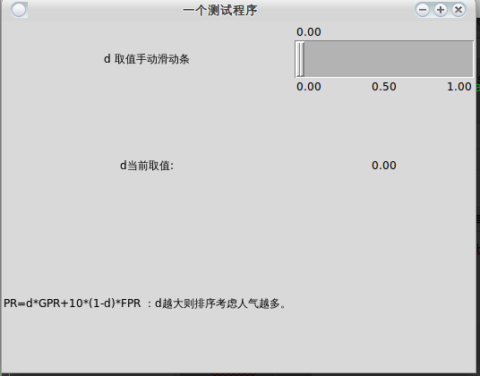

原文链接见：[http://blog.csdn.net/zazzle/article/details/8998612](http://blog.csdn.net/zazzle/article/details/8998612)

这里使用Tkinter库，还有很多别的图形库，但是我觉得Tkinter比较简单，我才学几天，但是就有点入门了，一些基本的思想，基本函数的意思也大致弄清了，所以Tkinter还是比较简单易用的。

别的不多说，先上代码：
```python
  #!/usr/bin/python
  #-*- coding:utf-8 –*-

  from Tkinter import *
  win = Tk()
  #win.title('google search engine optimal')
  win.title('一个测试程序')
  # the top level of the window
  def report(text):
          #print(v.get())
      entry2 = Label(root, text = v.get())
      entry2.grid(row = 1, column = 1)

  root = Frame(win)
  root.pack()
  label1 = Label(root, text = 'd 取值手动滑动条', width = 25)
  label1.pack(side = LEFT)
  label1.grid(row = 0, column = 0)
  v = StringVar()
  scl = Scale(root, from_ = 0, to = 1, tickinterval = 0.5, resolution = 0.01, orient = 'horizontal', variable=v, sliderlength=10, width = 40, length = 200, command=report)
  scl.grid(row = 0, column = 1)

  print (scl.get())
  label2 = Label(root, text = 'd当前取值:', height = 10)
  label2.grid(row = 1, column = 0)


  label3 = Label(root, text = 'PR=d*GPR+10*(1-d)*FPR ：d越大则排序考虑人气越多。', height = 10)
  label3.grid(row = 2)
  root.mainloop()
```

效果如下：




说说我的看法吧，
用Tkinter画图首先要创建一个根挂件，可以用Tk()产生
然后要产生不同类型的小挂件，有标签Label，按钮Button，接口Entry 之类的，具体的查看网上的详细文档。
比如说用widget = Label(None, text = 'hello')产生了一个内容为hello的标签之后还要确定把这个标签放在哪个位置，所以就要用到pack()
pack有很多选项，比如说要不要随着屏幕缩放expand，要不要填充fill，还可以设置位置anchor。
pack完了之后要维持这个窗口的运行，root.mainloop()或者是widget.mainloop()都行。

这样产生的窗口只能有一个挂件，如果要把多个挂件放在一个窗口就要用到容器Frame()
win = Frame(root) 产生一个叫作win的容器，下面要产生的挂件都是放在这个容器里面的。

```python
widget1 = Label(win, text = 'widget1')
widget1.pack(side = TOP)
widget2 = Button(win, text = 'button')
widget2.pack(side = TOP)
```

就能产生类似下图的效果：


