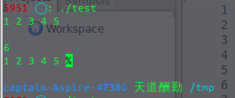

原文链接见：[http://blog.csdn.net/zazzle/article/details/9226767](http://blog.csdn.net/zazzle/article/details/9226767)

今天在写一个排序的小程序的时候偶然发现scanf使用的一个小小的陷阱，如果没有见过的话很难发现的。
比如说scanf("%d", &A) 和 scanf("%d ", &A)这2个语句有区别吗？不仔细看是看不出区别的，前者%d后面紧跟这的是引号，后者%d后面加了一个空格然后再是引号。

```C
/* test1.c */
#include <stdio.h>
#define N 5

int main(void) {
  int A[N];
  int i;
  for (i = 0; i < N; i++) {
    scanf("%d", &A[i]);
  }
  for (i = 0; i < N; i++) {
    printf("%d ", A[i]);
  }
  return 0;
}
```


这个程序的目的是从屏幕输入5个数字，并打印出来，这个程序运行的结果很正常，但是如果换第二种情况
```C
/* test2.c */
#include <stdio.h>
#define N 5

int main(void) {
  int A[N];
  int i;
  for (i = 0; i < N; i++) {
    scanf("%d ", &A[i]);
  }
  for (i = 0; i < N; i++) {
    printf("%d ", A[i]);
  }
  return 0;
}
```




就是多了一个空格但是却要输入6个数字才能打印前5个数字出来，真是奇怪啊。
上网搜了一下发现[https://stackoverflow.com/questions/12704907/explain-what-is-difference-between-without-whitespace-in-scanf-and-with-whitespa](https://stackoverflow.com/questions/12704907/explain-what-is-difference-between-without-whitespace-in-scanf-and-with-whitespa) 有人问同样的问题，
里面的答案说是scanf函数中前面用引号引起来的字符串是匹配字符串，里面一个空格可以匹配多个空格，tab, 回车，所以在第二种情况下输完5的时候输入回车想结束对整个数组的输入，但是C编译器却觉得你的输入还没有结束，所以会继续等待输入，这时候如果加入一个Ctrl-D就行了，在linux中这个是文件终止符。
看到这里发现输入和输出里面也有这么多技巧，我们从屏幕输入时编译器会把输入的一切东西当作一个字符串存起来，然后和匹配字符串匹配，匹配完了的才能保存到变量中，
这里面的匹配算法可以深入研究一下。
